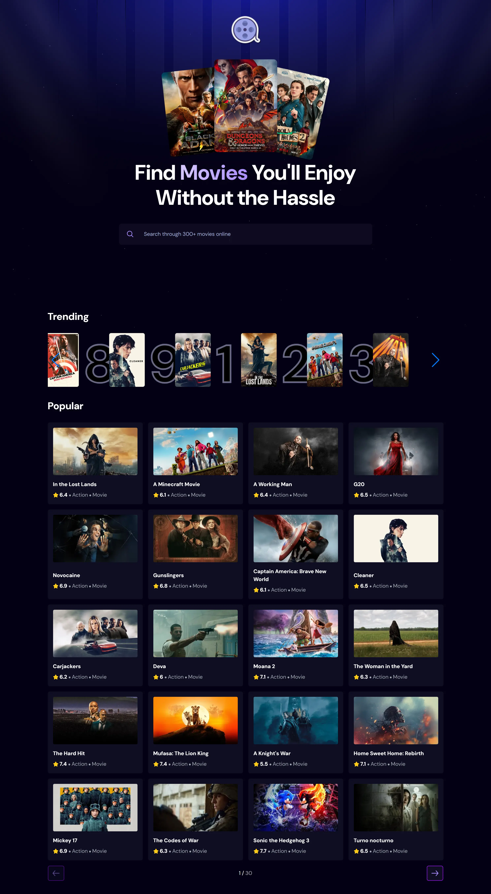

# Find Movies 🎥

[Find Movies](https://find-movies-tvshows-project.vercel.app/) a React-based movie discovery application built with Vite, Tailwind CSS, and Swiper.js that connects to The Movie Database (TMDB) API to let users explore popular movies, search titles with debounced queries, and view live trending metrics powered by a local PostgreSQL database and Express.js REST API.

---

## Features ✨

- **Trending Movies**: Displays the top 9 trending movies fetched from (the Appwrite database) now Local PostgreSQL database.
- **Search Functionality**: Allows users to search for movies by title and view the results in a grid layout.
- **Search Tracking**: Tracks user searches and stores the first search result in the Appwrite database with a counter.
- **Popular Movies with Pagination**: Browse through popular movies with the ability to navigate between pages.
- **Movie & TV Details Modal**: Click any movie or TV show (in Popular, Search, or Trending) to view a details modal with overview, rating, release date, runtime/seasons, genres, and content rating — without leaving the page.
- **Responsive Design**: Fully responsive layout optimized for all screen sizes.
- **Hover Effects**: Interactive hover effects to display additional movie details.
- **Error Handling**: Displays toast notifications for errors like failed API requests.

---

## Tech Stack 🛠️

- **Frontend**: React, Vite, Tailwind CSS, Swiper.js, React-Toastify, React-Use (useDebounce)
- **Backend**: Node.js, Express, PostgreSQL
- **Database**: Local PostgreSQL
- **External API**: TMDB API v4 (The Movie Database)

---

## 📋 Summary of Changes Done

Here is a breakdown of the architectural refactoring done to transition the application from Appwrite Cloud BaaS to a fully local SQL setup:

1. **Database Layer (Appwrite → PostgreSQL)**
   * **Schema Design:** Created a dedicated `metrics` table in local PostgreSQL with strong types (`SERIAL`, `INT`, `VARCHAR`, `TIMESTAMP`).
   * **Performance & Data Integrity:** Added a `UNIQUE` constraint on `movie_id` to allow atomic UPSERT operations and created an index on `count DESC` to make top-9 queries near-instantaneous.

2. **Custom Backend API (`server/`)**
   * **Express Server:** Created a lightweight Node.js/Express REST server acting as an intermediary between the browser and PostgreSQL (since browsers cannot directly access database socket ports).
   * **Atomic UPSERT Query:** Replaced multi-step document checking with a single SQL query (`INSERT ... ON CONFLICT (movie_id) DO UPDATE SET count = metrics.count + 1`) to eliminate race conditions when tracking search counts.

3. **Frontend Integration (`src/db.js` & `App.jsx`)**
   * **SDK Removal:** Uninstalled `@appwrite/sdk` dependencies and removed project/collection environment variables.
   * **Service Abstraction:** Created `src/db.js` using standard `fetch()` calls targeting `http://localhost:5000/api/movies`.
   * **State Synchronization:** Updated `App.jsx` to immediately re-fetch and refresh `trendingMovies` after a successful search execution.

4. **UI & API Authentication Fixes**
   * **Image URL Resolution:** Fixed image rendering in `TrendingMovies.jsx` by passing full poster URLs directly instead of concatenating TMDB base paths twice.
   * **TMDB Bearer Auth:** Switched from the v3 short API key to the TMDB v4 **API Read Access Token** in `APi_OPTIONS` headers, resolving `401 Unauthorized` empty array errors.

---

## Installation 🚀

1. Clone the repository:
   ```bash
   git clone https://github.com/BenzidaneMo/find-movies-tvshows-project.git
   cd find-movies-tvshows-project
   ```
2. Create a .env.local file in your root project directory:   
```
   VITE_TMDB_API_KEY=your_tmdb_v4_read_access_token_here
```
3. Start the Express Backend Server:
   ```bash
   cd server
   npm install
   node index.js
   ```
4. Start the React Application:
   ```bash
   # In the project root folder
   npm install
   npm run dev
    ```
5. Open the app in your browser at http://localhost:5173.

---

## Local Database Setup 🛠️

Execute the following SQL commands in your local PostgreSQL shell (psql) or database manager (Beekeeper Studio, DBeaver, or PgAdmin):
```
-- 1. Create the database
CREATE DATABASE find_movies_db;

-- 2. Create the metrics table
CREATE TABLE metrics (
    id SERIAL PRIMARY KEY,
    movie_id INT NOT NULL,
    movie_name VARCHAR(255) NOT NULL,
    search_term VARCHAR(255) NOT NULL,
    count INT DEFAULT 1,
    poster_url TEXT NOT NULL,
    media_type VARCHAR(10) DEFAULT 'movie',
    created_at TIMESTAMP WITH TIME ZONE DEFAULT CURRENT_TIMESTAMP,
    updated_at TIMESTAMP WITH TIME ZONE DEFAULT CURRENT_TIMESTAMP,
    UNIQUE (movie_id, media_type)
);

-- 3. Create index for fast sorting on search counts
CREATE INDEX idx_metrics_count ON metrics (count DESC);
```

If you already have an existing `metrics` table (local Postgres or Supabase) from before movie/TV details support was added, run this migration instead of recreating the table. TMDB ids are only unique *within* a media type (a movie and a TV show/anime can share the same numeric id), so a `UNIQUE` constraint on `movie_id` alone lets a searched TV show collide with an unrelated movie (or vice versa) and overwrite its row. Switch to a composite key:
```sql
ALTER TABLE metrics ADD COLUMN IF NOT EXISTS media_type VARCHAR(10) DEFAULT 'movie';
ALTER TABLE metrics DROP CONSTRAINT IF EXISTS metrics_movie_id_key;
ALTER TABLE metrics ADD CONSTRAINT metrics_movie_id_media_type_key UNIQUE (movie_id, media_type);
```

---

## API Integration 🌐

The app uses the **TMDB API** and **Appwrite** for data fetching and storage. Below are the endpoints and functions used:

**TMDB API:**

1. **Discover Movies:**

- Endpoint: /discover/movie
- Parameters: sort_by=popularity.desc, include_adult=false, language=en-US, page

2. **Search Movies:**

- Endpoint: /search/movie
- Parameters: query, include_adult=false, language=en-US, page=1


---

## How It Works ⚙️

1. **Trending Movies:**

- Fetched from (the Appwrite database) postgresql database based on user searches.
- Displays the top 9 movies with the highest search counts.

2. **Search Functionality:**

- Fetches movies from the /search/movie endpoint based on the user's query.
- Tracks the first search result and updates the Appwrite database.

3. **Popular Movies with Pagination:**

- Fetches movies from the /discover/movie endpoint.
- Allows users to navigate between pages using "Next" and "Previous" buttons.

4. **Error Handling:**

- Displays toast notifications for errors like failed API requests or empty search results.

---

## Screenshot



---
## Folder Structure 📂
```
react-project/
├── public/                 # Public assets
├── server/
│   ├── db.js          # PostgreSQL connection pool configuration
│   ├── index.js       # Express server & raw SQL API routes
│   └── package.json   # Backend node dependencies
├── src/
│   ├── components/         # React components
│   │   ├── Header.jsx
│   │   ├── SearchResults.jsx
│   │   ├── TrendingMovies.jsx
│   │   ├── PopularMovies.jsx
│   │   ├── MovieCard.jsx        # Shared movie/TV card used by all three sections above
│   │   ├── MovieDetailsModal.jsx # Movie/TV details modal
│   │   └── Footer.jsx
│   ├── services/
│   │   └── tmdb.js         # Centralized TMDB fetch calls + image/genre/certification helpers
│   ├── hooks/
│   │   └── useGenreMap.js  # Resolves TMDB genre ids to names
│   ├── [App.jsx]                                        # Main app component
|   ├── db.js               # Service abstraction for local REST endpoints
│   ├── index.css           # Global styles
│   └── main.jsx            # Entry point
├── .env.local              # Environment variables (TMDB Token)
├── [package.json]                                       # Project dependencies
└── [README.md]                                          # Project documentation
```

---

## Acknowledgments 🙌

- TMDB API for providing movie data.
- Appwrite for backend services.
- React for the frontend framework.
- Tailwind CSS for styling.
- Swiper.js for the carousel functionality.
- React Toastify for toast notifications.
